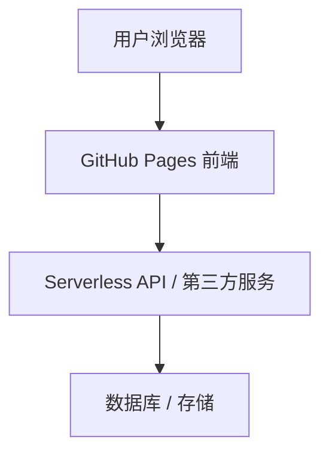

# WHPEmind
# 📦 一个Markdown=>思维导图的用户工具
# 主播目前处于文档开发阶段
## 1. 项目背景与目标
- **背景**：
    - 本项目旨在通过 GitHub Pages + Serverless/第三方后端，开发一个低成本的 Web 应用。
    - 为被公司监管的社畜提供知识产出的导出途径
        （不能哪天辞职了，还带不走自己在公司积累的各类经验）
    - 开发阶段，本项目免费开源，欢迎各位开发者参与开发
        ### **开发者权益**
        1. 开发者将终身拥有此app的使用权限
        2. 本项目上线后的各类收益（假设有的话），金额少量直接分，金额大量则导入股份权重
        3. 联系邮箱：
            - w1449271571@163.com
            - **vx：**_ChiYMY
- **特点**：免费托管、低维护成本、易扩展
- **目标**：
    1. 基本的MarkDown实时编辑查看
    2. 基本的思维导图拖拉拽，节点连接，Show模式展示
    3. MarkDown向思维导图双向转化（标题即结点）
    4. 在思维导图中可以点开结点，查看内容
    5. 在查看内容时可以将思维导图缩小并可拖动，标识当前结点
    6. MarkDown可向HTML，Word，PDF，Execl双向转化
    7. 支持快捷键，以及鼠标右键的接管
    8. 接入用户网络社群，提供客制化方案
---

## 2. 功能需求
### 前端
- 登录注册：目前仅思考无二段认证，无任何第三方平台账号
    （便于各位上班跳开公司监管直接账号密码登录）
- 键盘快捷键设置
- MarkDown的富文本编辑
- 思维导图编辑，样式格式
- 多语言支持
---

### 后端
- 登陆注册数据处理
- 储存用户文档
- 时间戳保存用户操作的结点，样式格式
---

## 3. 技术选型
- **前端托管**：GitHub Pages  
- **框架/库**：{React / Vue / 原生 JS}  
- **后端**：{Firebase / Supabase / Cloudflare Workers}  
- **数据库**：{Firestore / PostgreSQL / Google Sheets API}  
- **域名（可选）**：GitHub.io 子域名 or 自定义域名  

---
## 4. 系统架构

---

## 5. 开发计划
 阶段 1：前端页面设计与部署
 阶段 2：接入后端 API
 阶段 3：实现数据存储与认证
 阶段 4：测试与优化
 阶段 5：上线与维护
## 6. 开发规范
代码管理：
main 分支 → 发布版本
dev 分支 → 开发版本
提交规范：
feat: 新功能
fix: 修复 bug
docs: 文档更新
接口文档：见 docs/api.md
## 7. 测试与发布
测试：
浏览器手动测试交互
Postman/curl 测试 API
发布：
Push 到 main 分支 → GitHub Actions 自动构建 → GitHub Pages 部署
## 8. 运维与成本控制
监控：使用 {Firebase/Supabase Dashboard} 查看调用情况
成本优化：
优先使用免费额度（如 Cloudflare Workers 每月 10 万次请求）
大量数据存储可用 Google Sheets/Airtable
日志与回滚：Git commit 历史即为回滚方案
## 9. 后续迭代计划
 增加 PWA 支持（离线缓存）
 增加更多交互页面
 增加支付/广告变现功能
 优化性能与安全
## 10. 附录
术语表：
Serverless：无服务器架构，按调用计费
CI/CD：持续集成与部署
参考资料：
GitHub Pages 官方文档
Firebase 文档
Supabase 文档